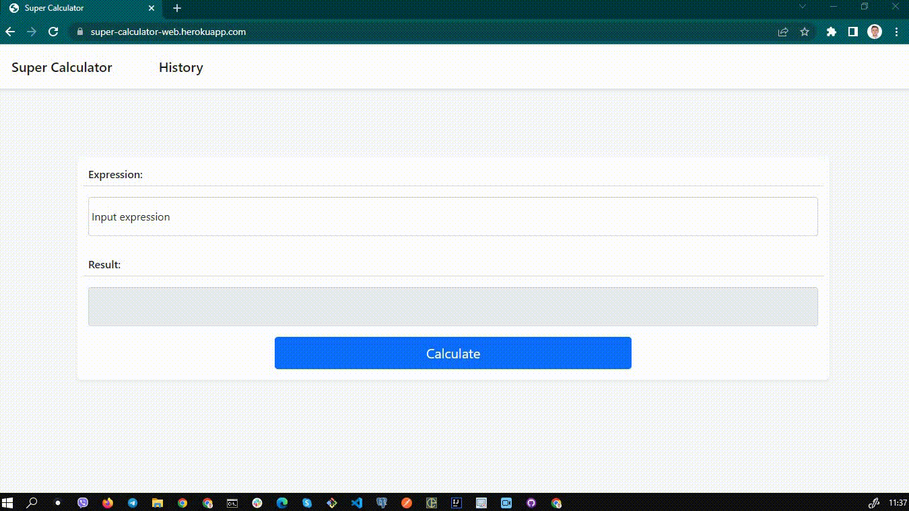
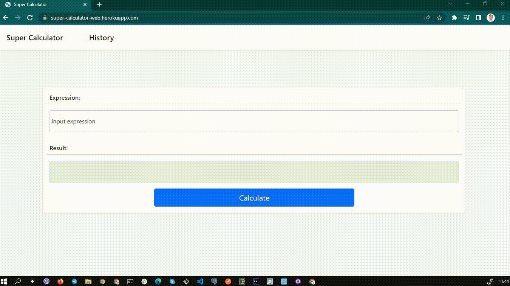

<h1 align="center">SuperCalculator</h1>
<h2 align="center">

<h3 align="center"> This is a test task for GeeksForLess </h3>
<h2 align="center"><a  href="https://super-calculator-web.herokuapp.com/">Live Demo</a></h2>

### Description

Web calculator implemented on Spring Boot. It contains a main page with an input field and validation of the entered expression. If the expression is correct, the calculation is performed and saved to the database. You can edit database records on the history page

                     #### Description

                     #### Validation

